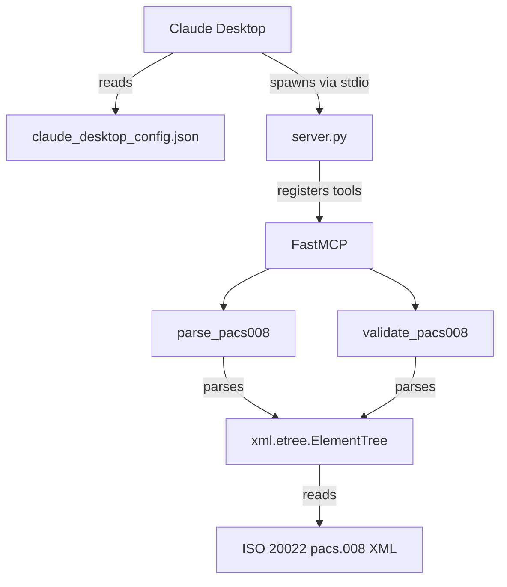

# Architecture

## Flow

1. **Claude Desktop** loads `claude_desktop_config.json` at startup to discover MCP servers.
2. It spawns `server.py` as a subprocess and communicates over **stdio** (stdin/stdout).
3. `server.py` instantiates **FastMCP**, which registers the `parse_pacs008` and `validate_pacs008` tools.
4. When a tool is invoked, it uses **`xml.etree.ElementTree`** to parse the supplied **pacs.008 ISO 20022 XML** and returns structured JSON to Claude.
