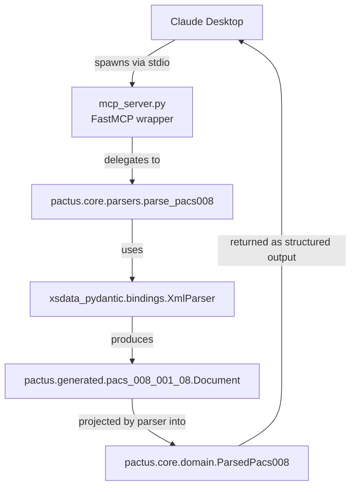

# Architecture

## Flow

Claude Desktop spawns `mcp_server.py` as a subprocess and communicates over stdio. The server is a thin FastMCP wrapper: each tool delegates immediately to a pure function in `pactus.core`. For `parse_pacs008`, the parser feeds the XML to `xsdata_pydantic`'s `XmlParser`, which emits a generated `Document` object, then projects the relevant fields onto the curated domain model `ParsedPacs008`. The MCP layer returns that model as structured output to the client.

## Two-layer model design

The package keeps the generated and domain models strictly separate:

- **Generated layer** (`pactus.generated`) — ~510 xsdata-emitted Pydantic classes that mirror the XSDs verbatim. Ugly but faithful, this is the source of truth for what the wire protocol allows.
- **Domain layer** (`pactus.core.domain`) — a small set of curated, LLM-facing models with native Python types (`Decimal`, `datetime`, `date`) and human-readable field names. Built on a `MoneyDecimal` annotated type that enforces ISO 4217 currency precision.

Generated models never escape `parsers.py`. Everything outside the parser sees only domain types.
